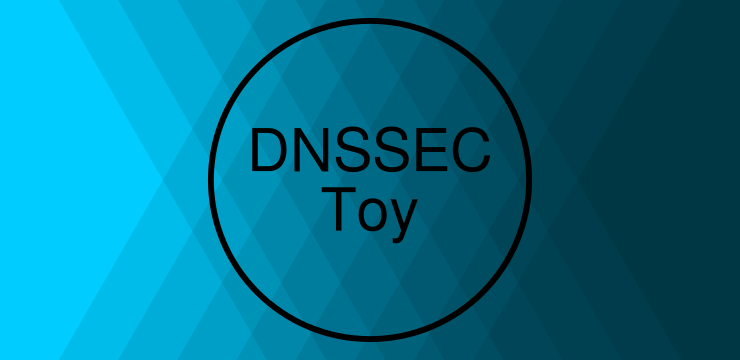

# DNSSEC Toy

A DNSSEC server and resolver implementation.

This project includes:

* an authoritative server;
* an iterative resolver;
* a keypair generator tool;
* a zone signing tool;
* and an example tree for testing.

This was one of my homeworks for the [Information Security][is] course.

## Build

Run:

    mvn package

## Example

Go to `example`:

    cd example

This is the representation of the tree used:

    . (ns1.)
    |
    +-ro. (ns1.ro. ns2.ro.)
    | |
    | +-ns1.ro.
    | |
    | +-ns2.ro.
    | |
    | +-pers.ro. (ns1.pers.ro.)
    | | |
    | | +-ns1.pers.ro.
    | | |
    | | +-paul.pers.ro.
    | | |
    | | +-andrei.pers.ro.
    | | |
    | | +-ion.pers.ro.
    | | |
    | | +-maria.pers.ro.
    | |
    | +-com.ro. (ns1.com.ro.)
    | | |
    | | +-ns1.com.ro
    | | |
    | | +-lumina.com.ro.
    | | |
    | | +-inet.com.ro.
    | |   |
    | |   +-a.inet.com.ro
    | |   |
    | |   +-b.inet.com.ro
    | |   |
    | |   +-c.inet.com.ro
    | |
    | +-a.ro.
    | |
    | +-b.ro.
    | |
    | +-c.ro.
    | |
    | +-d.ro.
    | |
    | +-e.ro.
    | |
    | +-f.ro.
    |
    +-net. (ns1.net.)
    | |
    | +-ns1.net.
    | |
    | +-a.net.
    | |
    | +-b.net.
    | |
    | +-c.net.
    | |
    | +-d.net.
    | |
    | +-e.net.
    | |
    | +-f.net.
    | |
    | +-g.net.
    | |
    | +-h.net.
    | |
    | +-i.net.
    |
    +-ns1.

Start the authoritative servers (you need `tmux`):

    tmux -f authoritative.conf attach

## License

MIT

[is]: http://www.infoiasi.ro/bin/Programs/CS3102_11
